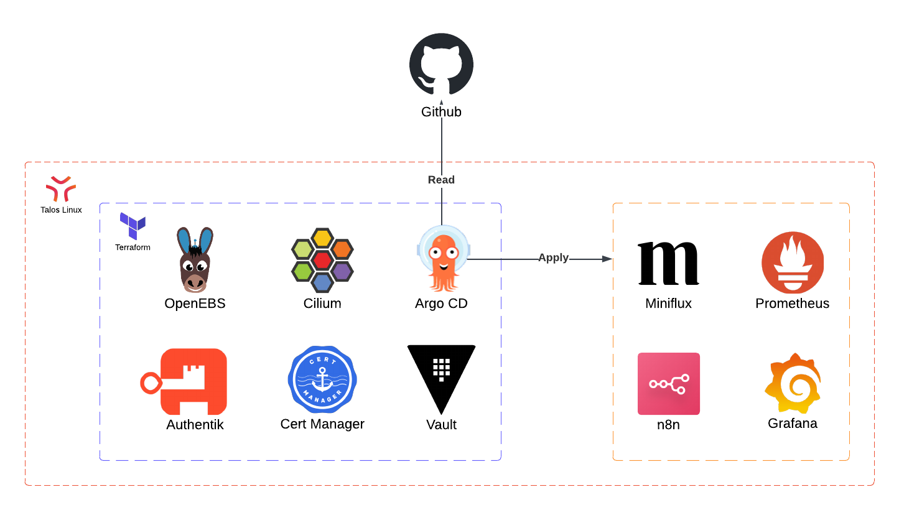

# Homelab
This repository contains a work-in-progress Kubernetes-based homelab where core platform components are provisioned with Terraform and applications are deployed using Argo CD. Terraform sets up essential services while Argo CD manages application deployments and keeps the cluster aligned with a GitOps workflow.

## What's Inside

The setup is split into two main parts:
- Terraform, which bootstraps the foundation (check the [doc](./terraform/README.md) for further details).
- Argo CD, which deploys and manages the applications defined in this repository.

This design tracks and versions all infrastructure changes, making it easy to reproduce the cluster in another environment. Terraform bootstraps core services like Vault and Authentik, while Argo CD deploys and manages applications using GitOps.

### Key Components
- Cilium: Provides cluster networking, replaces kube-proxy, and implements the Gateway API used to expose services.
- Cert Manager: Manages TLS certificates using Let’s Encrypt. DNS challenge is handled through Cloudflare.
- OpenEBS: Provides dynamic persistent storage through Kubernetes-native storage classes, supporting both local and replicated volumes.
- Vault: Central source of truth for secrets such as API keys, database credentials, and service configuration.
- Vault Secrets Operator (VSO): Syncs secrets from Vault into native Kubernetes Secrets so workloads can consume them without embedding sensitive data in manifests or repositories.
- Authentik: Identity provider for authentication and SSO across cluster services.
- Argo CD: The GitOps engine that keeps the cluster in sync with this repository. Any changes pushed here get automatically reflected in the cluster.

<!-- ### Applications Deployed -->

## Getting Started
For my setup, I use Talos Linux because it’s lightweight, minimal, and built specifically for running Kubernetes. Kubernetes on Ubuntu works as well, but make sure your cluster has no CNI installed before proceeding. For Talos, you can check the [documentation](./talos/README.md) I made and use the provided script to generate machine configs for control planes and workers with preconfigured settings applied via a patch template. It saves time, and all you need to do is apply the configs onto the machines after booting Talos.

With the cluster ready, the next step is provisioning the platform stack with [Terraform](./terraform/README.md). Terraform lays down the base layer of the cluster by applying a series of ordered phases that install and configure components like Cilium, Cert Manager, OpenEBS, Vault, Authentik, and Argo CD. Each phase lives in its own directory and is meant to be applied in sequence.

Once Terraform finishes laying down the core platform components, Argo CD takes the wheel. The repository follows an App-of-Apps pattern, where syncing the root application triggers the deployment of all other applications and keeps them continuously reconciled through GitOps.

<!-- ### Architecture -->

<!-- ### Hardware Used -->

## To-do
What's planned for the homelab as it evolves. Ideas below may change and more may be added.

### Infra
- [x] Learn and setup Talos
- [ ] Deploy the following with Argo CD
  - [ ] [homepage](https://github.com/gethomepage/homepage)
  - [ ] [n8n](https://docs.n8n.io/hosting/)
  - [ ] [FreshRSS](https://freshrss.org/)
  - [ ] [Karakeep](https://github.com/karakeep-app/karakeep)
  - [ ] [bentopdf](https://github.com/alam00000/bentopdf)
  - [ ] [changedetection.io](https://github.com/dgtlmoon/changedetection.io/)
  - [x] [kube-prometheus-stack](https://github.com/prometheus-community/helm-charts/tree/main/charts/kube-prometheus-stack)
  - [ ] [Grafana Loki](https://grafana.com/docs/loki/latest/setup/install/helm/)
- [ ] Pi-hole
- [x] Migrate from NGINX Ingress Controller to Cilium's Gateway API

### Security
- [x] Deploy [Authentik](https://github.com/goauthentik/helm/blob/main/charts/authentik/README.md) using Terraform
  - [x] Integrate SSO across platforms
- [ ] Setup audits (plan storage and retention accordingly)
  - [ ] Kubernetes audits
  - [ ] Vault audit logging 
  - [ ] Send logs to a central server
- [x] Define and enforce pod security contexts  
- [ ] Cilium network policies
- [ ] Protect web UIs using Authentik [Proxy Provider](https://docs.goauthentik.io/add-secure-apps/providers/proxy/forward_auth/) (Prometheus UI, Alertmanager UI, etc.)
- [ ] Jobs to scan containers for vulnerabilities

### n8n
- [ ] RSS feed summarizer
- [ ] Check every app installed by Helm for new versions and notify with a summary of the changelogs
  - [ ] Create PRs for automatic upgrade (e.g. update image tags in the manifests or chart version)
  - [ ] Notify on list of apps/repos releases (e.g. Kubernetes, GitLab)
- [ ] Alert for product verions approaching end of life
- [ ] Alert on newly discovered vulnerabilities for homelab apps