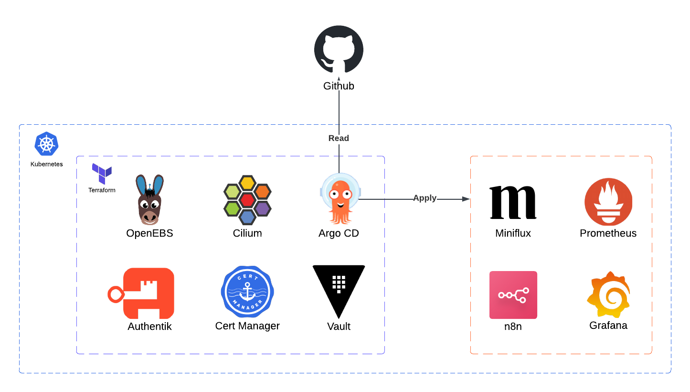

# Homelab
A Kubernetes-based homelab where core platform components are provisioned with Terraform and applications are deployed using Argo CD. Terraform sets up the essential platform services while Argo CD manages application deployments and continuously reconciles the cluster with this repository.

This is basically my personal playground for self-hosting, automation, and experimenting with new tools and ideas.

## What's Inside

The setup is split into two main parts:
- Terraform, which bootstraps the foundation (check the [doc](./terraform/README.md) for further details).
- Argo CD, which deploys and manages the applications defined in this repository.

This design tracks and versions all infrastructure changes, making it easy to reproduce the cluster in another environment. Terraform bootstraps core services like Vault and Authentik, while Argo CD deploys and manages applications in GitOps fashion.

The observability stack is built on kube-prometheus-stack, Loki, and Alloy, covering metrics, logs, and alerting across the cluster. Everything is wired into Grafana for dashboards and log exploration.

### Key Components
- Cilium: Provides cluster networking, replaces kube-proxy, and implements the Gateway API used to expose services.
- Cert Manager: Manages TLS certificates using Let’s Encrypt. DNS challenge is handled through Cloudflare.
- OpenEBS: Provides dynamic persistent storage through Kubernetes-native storage classes, supporting both local and replicated volumes.
- Vault: Central source of truth for secrets such as API keys, database credentials, and service configuration.
- Vault Secrets Operator (VSO): Syncs secrets from Vault into native Kubernetes Secrets so workloads can consume them without embedding sensitive data in manifests or repositories.
- Authentik: Identity provider for authentication and SSO across cluster services.
- Argo CD: The GitOps engine that keeps the cluster in sync with this repository. Any changes pushed here get automatically reflected in the cluster.

## Getting Started
You can use either Vanilla Kubernetes or Talos Linux.

If you install Kubernetes yourself, you can use the setup in [`scripts/kubespray`](./scripts/kubespray/). It uses Kubespray to install Kubernetes and configure the required security settings, such as PSA `restricted` and audit logging.

If you wanna use Talos Linux, you can check the setup I made in [`scripts/talos`](./scripts/talos/) which generates configs for you with a step-by-step documentation.

With the cluster ready (with no CNI, kube-proxy, and nodelocaldns deployed), the next step is provisioning the platform stack with [Terraform](./terraform/README.md). Terraform lays down the base layer of the cluster by applying a series of ordered phases that install and configure components like Cilium, Cert Manager, OpenEBS, Vault, Authentik, and Argo CD. Each phase lives in its own directory and is meant to be applied in sequence.

Once Terraform finishes laying down the core platform components, Argo CD takes the wheel. The repository follows an App-of-Apps pattern, where syncing the root application triggers the deployment of all other applications and keeps them continuously reconciled.