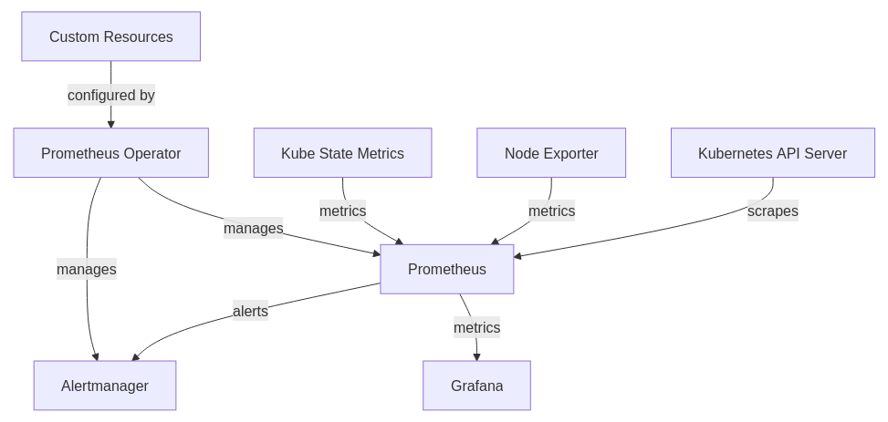

# Observability
Running a Kubernetes cluster without visibility into what's happening inside it is a recipe for unpleasant surprises. The goal of this setup is to have full insight into cluster health and workload performance, receive alerts when something goes wrong, and visualize everything through dashboards.

## kube-prometheus-stack
kube-prometheus-stack is a Helm chart that deploys a full monitoring stack for Kubernetes, including Prometheus for metrics collection, Alertmanager for alerting, and Grafana for visualization. It already has pre‑configured Prometheus rules created via the operator’s CRDs and built‑in target health monitoring, so you get some visibility into the cluster out of the box.

<figure>
  
  <figcaption>
    <a href="https://www.compilenrun.com/docs/observability/prometheus/prometheus-and-kubernetes/kube-prometheus-stack/#understanding-the-architecture">
      Reference
    </a>
  </figcaption>
</figure>

You have these CRDs from the Prometheus Operator that extend Kubernetes to drive observability:
- `ServiceMonitor`: Declaratively defines how Prometheus should discover and scrape metrics from a set of Kubernetes Services.
- `PodMonitor`: Declaratively defines how Prometheus should discover and scrape metrics from a set of Kubernetes Pods.
- `PrometheusRule`: Defines alerting and recording rules that Prometheus will evaluate.
- `AlertmanagerConfig`: Lets you configure Alertmanager config in a CRD form that gets merged into Alertmanager’s effective config.
- `Prometheus`: Configures a Prometheus instance itself, including replicas, storage, and associated config-based resources which then creates a `StatefulSet`.
- `Alertmanager`: Configures an Alertmanager instance deployment which then creates a `StatefulSet`.

### Prometheus
`ServiceMonitors` and `PodMonitors` are the primary mechanism for telling Prometheus what to scrape. Each defines a set of label selectors to match target services or pods, and Prometheus discovers them based on its own selector configuration.

By default, Prometheus only picks up monitors from its own namespace or those matching specific labels. To make it discover all `ServiceMonitors` and `PodMonitors` across all namespaces automatically, `prometheusSpec` in the Helm values needs to be set with the following:
```yaml
prometheus:
  prometheusSpec:
    serviceMonitorSelector: {} # Select all ServiceMonitors
    serviceMonitorNamespaceSelector: {} # From all namespaces
    podMonitorSelector: {}
    podMonitorNamespaceSelector: {}
    # Prevent Helm from restricting discovery to only its own values
    podMonitorSelectorNilUsesHelmValues: false
    serviceMonitorSelectorNilUsesHelmValues: false
```

The empty `{}` selectors act as a wildcard, they basically match everything. Setting the `*NilUsesHelmValues` flags to `false` ensures the chart does not fall back to Helm’s default selectors and instead uses the explicit empty selectors defined above ([reference](https://github.com/prometheus-community/helm-charts/blob/main/charts/kube-prometheus-stack/README.md#prometheusioscrape)).

For workloads that don't expose a ServiceMonitor or PodMonitor (or workloads outside the cluster), you can define scrape targets directly using `additionalScrapeConfigs`:
```yaml
prometheus:
  prometheusSpec:
    additionalScrapeConfigs:
      - job_name: "custom"
        static_configs:
          - targets: ["app.namespace.svc:9100"]
```

#### Talos Linux
Prometheus can scrape the Controller Manager and Scheduler, but by default in Talos Linux the bind is set to `127.0.0.1` which makes them unreachable from within the cluster for security practices. To expose their metrics, change the bind address to `0.0.0.0` by using the following Talos machine config:
```yaml
cluster:
  controllerManager:
    extraArgs:
      bind-address: 0.0.0.0
  scheduler:
    extraArgs:
      bind-address: 0.0.0.0
```
Note that exposing these on all interfaces does introduce a network exposure risk, so it's worth protecting them with a firewall. Luckily Talos supports [ingress firewall](https://docs.siderolabs.com/talos/latest/networking/ingress-firewall) rules natively. 

For etcd metrics, refer to the Talos etcd metrics [guide](https://docs.siderolabs.com/kubernetes-guides/monitoring-and-observability/etcd-metrics).

### Alert Manager
Alertmanager handles routing and delivery of alerts fired by Prometheus. There are several ways to configure it within the chart:
- `alertmanager.config` is the default approach where you define the full Alertmanager configuration directly in the values file. If you go this route, make sure to include all required pieces like the null receiver, since it overwrites the chart's default config entirely.
  - It creates a Kubernetes secret behind the scene where Alertmanager's config can be found.
- `alertmanager.stringConfig` with `tplConfig: true` is useful when you need Helm templating inside your Alertmanager config (e.g. referencing other values or secrets by name).
- `alertmanagerSpec.useExistingSecret: true` is the current method in use here. With this option, the chart ignores `alertmanager.config` entirely and instead reads from a custom Kubernetes secret. The secret name is set via `alertmanagerSpec.configSecret` and is created by the Vault Secrets Operator, which pulls the SMTP credentials from Vault.
- `AlertmanagerConfig` CRD is a more modular approach where individual teams or namespaces can define their own routing rules, and Alertmanager merges them together. Discovery is controlled by `alertmanagerConfigSelector` and `alertmanagerConfigNamespaceSelector`.

### Grafana
Dashboards are managed through Grafana's provisioning system. Dashboard providers tell Grafana where to look for dashboards and how to handle them, while the dashboard definitions themselves specify what to actually load. You can check this [reference](https://github.com/grafana-community/helm-charts/blob/main/charts/grafana/README.md#import-dashboards) for more.

`dashboardProviders`: Here's where dashboards are located and how to handle them.
`dashboards`: Here are the actual dashboard definitions.

Example:
```yaml
grafana:
  dashboards:
    <provider-name>:
      <dashboard-identifier>:
        # dashboard definition (e.g. a Grafana.com dashboard ID, JSON, or URL)
```

Alternatively, you can use ConfigMaps with the Grafana sidecar: the chart includes a sidecar container that watches for ConfigMaps labeled as dashboards and automatically loads them into Grafana, which is useful for deploying dashboards alongside the applications they monitor.

#### Grafana Alertmanager
Grafana also has a built-in alerting system which is separate from Prometheus Alertmanager. You might be thinking what if we could make Grafana handle alerting instead of Prometheus Alertmanager? Thing is, you'd need configure it to evaluate Prometheus rules **internally** and route alerts through its **own** notification policies. Meaning you'll need to manually migrate the already created Prometheus rules into Grafana itself.

You could forward Prometheus Alertmanager's alerts into Grafana using Grafana's IRM via the [Grafana OnCall](https://grafana.com/docs/grafana-cloud/alerting-and-irm/irm/configure/integrations/integration-reference/oncall/alertmanager/) Alertmanager integration if you wanted.

You could also make Grafana can forward its alerts to Prometheus Alertmanager via a [contact point integration](https://grafana.com/docs/grafana/latest/alerting/configure-notifications/manage-contact-points/integrations/configure-alertmanager/).

For all other Grafana configuration (SMTP, auth, feature toggles, etc.), these go under `grafana.ini` in the values file ([doc reference](https://grafana.com/docs/grafana/latest/setup-grafana/configure-grafana)).

### Notes
- kube-prometheus-stack is deployed via Argo CD with [`ServerSideApply=true`](https://argo-cd.readthedocs.io/en/latest/proposals/server-side-apply/#summary) in the sync options. By default, Argo CD uses client-side apply, where the full manifest is sent from the client and changes are tracked via a `last-applied-configuration` annotation on the resource (similar to `kubectl apply`). Some of the CRDs bundled with this chart exceed that annotation's size limit, causing sync failures. Setting `ServerSideApply=true` tells Argo CD to use server-side apply instead, where the API server takes over field ownership and merging natively, bypassing the limitation.
  - Check this [doc](https://kubernetes.io/docs/reference/using-api/server-side-apply/) to know more about Kubernetes' Server-side apply.
- For resizing volumes related to Prometheus or Alertmanager (since both are StatefulSets), refer to this [document](https://github.com/prometheus-operator/prometheus-operator/blob/main/Documentation/platform/storage.md#resizing-volumes).

<!-- ## Loki -->