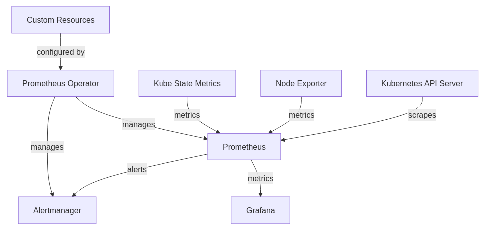

# Observability
Running a Kubernetes cluster without visibility into what's happening inside it is a recipe for unpleasant surprises. The goal of this setup is to have full insight into cluster health and workload performance, receive alerts when something goes wrong, and visualize everything through dashboards.

## kube-prometheus-stack
kube-prometheus-stack is a Helm chart that deploys a full monitoring stack for Kubernetes, including Prometheus for metrics collection, Alertmanager for alerting, and Grafana for visualization. It already has pre‑configured Prometheus rules created via the operator’s CRDs and built‑in target health monitoring, so you get some visibility into the cluster out of the box.

<figure>
  
  <figcaption>
    <a href="https://www.compilenrun.com/docs/observability/prometheus/prometheus-and-kubernetes/kube-prometheus-stack/#understanding-the-architecture">
      Reference
    </a>
  </figcaption>
</figure>

You have these CRDs from the Prometheus Operator that extend Kubernetes to drive observability:
- `ServiceMonitor`: Declaratively defines how Prometheus should discover and scrape metrics from a set of Kubernetes Services.
- `PodMonitor`: Declaratively defines how Prometheus should discover and scrape metrics from a set of Kubernetes Pods.
- `PrometheusRule`: Defines alerting and recording rules that Prometheus will evaluate.
- `AlertmanagerConfig`: Lets you configure Alertmanager config in a CRD form that gets merged into Alertmanager’s effective config.
- `Prometheus`: Configures a Prometheus instance itself, including replicas, storage, and associated config-based resources which then creates a `StatefulSet`.
- `Alertmanager`: Configures an Alertmanager instance deployment which then creates a `StatefulSet`.

### Prometheus
`ServiceMonitors` and `PodMonitors` are the primary mechanism for telling Prometheus what to scrape. Each defines a set of label selectors to match target services or pods, and Prometheus discovers them based on its own selector configuration.

By default, Prometheus only picks up monitors from its own namespace or those matching specific labels. To make it discover all `ServiceMonitors` and `PodMonitors` across all namespaces automatically, `prometheusSpec` in the Helm values needs to be set with the following:
```yaml
prometheus:
  prometheusSpec:
    serviceMonitorSelector: {} # Select all ServiceMonitors
    serviceMonitorNamespaceSelector: {} # From all namespaces
    podMonitorSelector: {}
    podMonitorNamespaceSelector: {}
    # Prevent Helm from restricting discovery to only its own values
    podMonitorSelectorNilUsesHelmValues: false
    serviceMonitorSelectorNilUsesHelmValues: false
```

The empty `{}` selectors act as a wildcard, they basically match everything. Setting the `*NilUsesHelmValues` flags to `false` ensures the chart does not fall back to Helm’s default selectors and instead uses the explicit empty selectors defined above ([reference](https://github.com/prometheus-community/helm-charts/blob/main/charts/kube-prometheus-stack/README.md#prometheusioscrape)).

For workloads that don't expose a ServiceMonitor or PodMonitor (or workloads outside the cluster), you can define scrape targets directly using `additionalScrapeConfigs`:
```yaml
prometheus:
  prometheusSpec:
    additionalScrapeConfigs:
      - job_name: "custom"
        static_configs:
          - targets: ["app.namespace.svc:9100"]
```

#### Talos Linux
Prometheus can scrape the Controller Manager and Scheduler, but by default in Talos Linux the bind is set to `127.0.0.1` which makes them unreachable from within the cluster for security practices. To expose their metrics, change the bind address to `0.0.0.0` by using the following Talos machine config:
```yaml
cluster:
  controllerManager:
    extraArgs:
      bind-address: 0.0.0.0
  scheduler:
    extraArgs:
      bind-address: 0.0.0.0
```
Note that exposing these on all interfaces does introduce a network exposure risk, so it's worth protecting them with a firewall. Luckily Talos supports [ingress firewall](https://docs.siderolabs.com/talos/latest/networking/ingress-firewall) rules natively. 

For etcd metrics, refer to the Talos etcd metrics [guide](https://docs.siderolabs.com/kubernetes-guides/monitoring-and-observability/etcd-metrics).

### Alert Manager
Alertmanager handles routing and delivery of alerts fired by Prometheus. There are several ways to configure it within the chart:
- `alertmanager.config` is the default approach where you define the full Alertmanager configuration directly in the values file. If you go this route, make sure to include all required pieces like the null receiver, since it overwrites the chart's default config entirely.
  - It creates a Kubernetes secret behind the scene where Alertmanager's config can be found.
- `alertmanager.stringConfig` with `tplConfig: true` is useful when you need Helm templating inside your Alertmanager config (e.g. referencing other values or secrets by name).
- `alertmanagerSpec.useExistingSecret: true` is the current method in use here. With this option, the chart ignores `alertmanager.config` entirely and instead reads from a custom Kubernetes secret. The secret name is set via `alertmanagerSpec.configSecret` and is created by the Vault Secrets Operator, which pulls the SMTP credentials from Vault.
- `AlertmanagerConfig` CRD is a more modular approach where individual teams or namespaces can define their own routing rules, and Alertmanager merges them together. Discovery is controlled by `alertmanagerConfigSelector` and `alertmanagerConfigNamespaceSelector`.

### Grafana
Dashboards are managed through Grafana's provisioning system. Dashboard providers tell Grafana where to look for dashboards and how to handle them, while the dashboard definitions themselves specify what to actually load. You can check this [reference](https://github.com/grafana-community/helm-charts/blob/main/charts/grafana/README.md#import-dashboards) for more.

`dashboardProviders`: Here's where dashboards are located and how to handle them.
`dashboards`: Here are the actual dashboard definitions.

Example:
```yaml
grafana:
  dashboards:
    <provider-name>:
      <dashboard-identifier>:
        # dashboard definition (e.g. a Grafana.com dashboard ID, JSON, or URL)
```

Alternatively, you can use ConfigMaps with the Grafana sidecar: the chart includes a sidecar container that watches for ConfigMaps labeled as dashboards and automatically loads them into Grafana, which is useful for deploying dashboards alongside the applications they monitor.

#### Grafana Alertmanager
Grafana also has a built-in alerting system which is separate from Prometheus Alertmanager. You might be thinking what if we could make Grafana handle alerting instead of Prometheus Alertmanager? Thing is, you'd need configure it to evaluate Prometheus rules **internally** and route alerts through its **own** notification policies. Meaning you'll need to manually migrate the already created Prometheus rules into Grafana itself.

You could forward Prometheus Alertmanager's alerts into Grafana using Grafana's IRM via the [Grafana OnCall](https://grafana.com/docs/grafana-cloud/alerting-and-irm/irm/configure/integrations/integration-reference/oncall/alertmanager/) Alertmanager integration if you wanted.

You could also make Grafana can forward its alerts to Prometheus Alertmanager via a [contact point integration](https://grafana.com/docs/grafana/latest/alerting/configure-notifications/manage-contact-points/integrations/configure-alertmanager/).

For all other Grafana configuration (SMTP, auth, feature toggles, etc.), these go under `grafana.ini` in the values file ([doc reference](https://grafana.com/docs/grafana/latest/setup-grafana/configure-grafana)).

### Notes
- kube-prometheus-stack is deployed via Argo CD with [`ServerSideApply=true`](https://argo-cd.readthedocs.io/en/latest/proposals/server-side-apply/#summary) in the sync options. By default, Argo CD uses client-side apply, where the full manifest is sent from the client and changes are tracked via a `last-applied-configuration` annotation on the resource (similar to `kubectl apply`). Some of the CRDs bundled with this chart exceed that annotation's size limit, causing sync failures. Setting `ServerSideApply=true` tells Argo CD to use server-side apply instead, where the API server takes over field ownership and merging natively, bypassing the limitation.
  - Check this [doc](https://kubernetes.io/docs/reference/using-api/server-side-apply/) to know more about Kubernetes' Server-side apply.
- For resizing volumes related to Prometheus or Alertmanager (since both are StatefulSets), refer to this [document](https://github.com/prometheus-operator/prometheus-operator/blob/main/Documentation/platform/storage.md#resizing-volumes).

## Loki
Grafana Loki is a log aggregation system built around the idea of indexing only metadata labels rather than the full log content, keeping storage and operational costs low while still enabling fast filtered queries via LogQL. It runs in `SingleBinary` mode with a single replica in the `monitoring` namespace alongside kube-prometheus-stack, using the local filesystem for storage. Rules are loaded from a ConfigMap mounted into the pod, and alerts are forwarded to kube-prometheus-stack's Alertmanager.

### Configs
For Loki's configuration, there are several ways to pass them within the Helm chart:
1. Use the already templated `loki.config` value. Whatever you define under `loki` in the Helm values gets merged into `loki.config` automatically, so the chart handles the heavy lifting and maintains sensible defaults over time.
2. Use `loki.structuredConfig` to fully replace the templated config. If you go this route, you must provide the entire Loki config including anything the chart normally handles, since it overwrites it entirely.
3. Supply an existing Secret or ConfigMap by setting `loki.generatedConfigObjectName`. Mostly useful when an external process generates or modifies the config.

Key values that feed into `loki.config` via the chart:
```yaml
loki:
  commonConfig:
    replication_factor: 1
  schemaConfig:
    configs:
      - from: "2024-04-01"
        store: tsdb
        object_store: filesystem
        schema: v13
        index:
          prefix: index_
          period: 24h
  pattern_ingester:
    enabled: true
  limits_config:
    allow_structured_metadata: true
    volume_enabled: true
```

### Cardinality
While configuring your log shipper (e.g. Grafana Alloy, Fluentbit) to send logs to Loki, there is an important concept to be aware of first. In Loki, every unique combination of label values creates a separate **stream**, which is a distinct chunk of log data that Loki indexes and stores independently. A stream looks like:
```
{job="kubernetes/audit", cluster="homelab-cluster", resource="pods", verb="create", username="admin"}
```

Loki maintains a separate index entry and storage chunk for every unique label combination, so labels must be low cardinality, meaning each label should have a small, finite set of possible values. There are maybe 10 verbs, 20 usernames, etc. — the combinations grow but stay manageable.

Things go bad when high-cardinality values end up as stream labels. For example, pod names, they're unique by design in Kubernetes, so adding `pod` as a stream label means every single pod creates its own stream. The consequences are:
- **Memory pressure:** Loki keeps active stream heads in memory; too many streams and it starts struggling.
- **Slow queries:** More streams to scan means slower log retrieval.
- **Ingestion errors:** You'll hit the `max_global_streams_per_user` limit (default `10000`) after which Loki starts dropping logs entirely.

The rule of thumb: if a label value is unbounded or contains unique identifiers (pod names, UUIDs, IPs, request IDs), it should never be a stream label. It belongs at query time only, applied via LogQL pipeline stages like `| json` or `| label_format` rather than promoted to labels at ingestion.

It's also worth being careful with Alloy's log processing pipeline. Using `loki.process` to parse JSON and mapping extracted fields directly into labels (like `request_id` or `pod_ip`) will create a new stream per unique value and blow up cardinality the same way. Extracted fields should stay as structured metadata or be used at query time rather than becoming stream labels.

### Alerts
Loki supports alerting via its ruler component, which evaluates LogQL rules similarly to how Prometheus evaluates PromQL rules, and routes resulting alerts through Alertmanager.

The homelab supports two key areas particularly worth alerting which are Kubernetes audit logs and Vault audit logs. Audit logs give you visibility into who is doing what inside the cluster and Vault respectively.

With Kubernetes audit, you could for example track who accessed Kubernetes secrets access:
```
sum by (user, object_namespace, cluster) (
  count_over_time(
    {job="kubernetes/audit", resource="secrets"}
    | json
    | verb =~ "get|list|watch"
    | user != "system:serviceaccount:vault-secrets-operator-system:vault-secrets-operator-controller-manager"
    | user !~ "system:serviceaccount:kube-system:.*"
    | user != "system:apiserver"
    [5m]
  )
) > 0
```

## Alloy
Grafana Alloy is an OpenTelemetry-compatible collector that can ingest, transform, and forward logs, metrics, traces, and profiles to any compatible backend. Currently it primarily handles log collection and forwarding to Loki, but its role may expand over time.

Alloy uses a Write-Ahead Log (WAL) to buffer collected logs to disk before forwarding them to Loki. This means if Loki is temporarily unavailable, logs are not lost. Alloy holds them in the WAL and delivers them once Loki is reachable again. It also decouples collection from delivery, so a spike in log volume won't directly pressure downstream components.

Alloy collects pod logs and cluster events by talking directly to the Kubernetes API using `loki.source.kubernetes` and `loki.source.kubernetes_events`, as described in this [guide](https://grafana.com/docs/alloy/latest/collect/logs-in-kubernetes). The flow looks like this:
```
┌─────────────────────────────────────────────────────┐
│ Kubernetes Cluster                                  │
│                                                     │
│  ┌─────────────────┐       ┌─────────────────────┐  │
│  │   Alloy Pod     │◄──────│   Kubernetes API    │  │
│  │   (DaemonSet)   │       │  (pod logs, events) │  │
│  └────────┬────────┘       └─────────────────────┘  │
│           │ push logs                               │
│           ▼                                         │
│    ┌─────────────┐                                  │
│    │  Loki Pod   │                                  │
│    │  (Single    │                                  │
│    │   Binary)   │                                  │
│    └──────┬──────┘                                  │
│           │                                         │
│           ▼                                         │
│    ┌─────────────┐                                  │
│    │   Grafana   │                                  │
│    │  (Explore / │                                  │
│    │   LogQL)    │                                  │
│    └─────────────┘                                  │
└─────────────────────────────────────────────────────┘
```

Alloy runs as user ID `65534` (`nobody`) which is sufficient for standard Kubernetes log collection via the API. If you plan to use eBPF-based components like [`beyla.ebpf`](https://grafana.com/docs/alloy/latest/reference/components/beyla/beyla.ebpf/), Alloy requires running as root. See the [non-root configuration docs](https://grafana.com/docs/alloy/latest/configure/nonroot/).

Vault audit logs are collected without any extra configuration. Vault runs a sidecar container that tails the audit log file and writes to stdout, so Alloy picks it up automatically as part of standard Kubernetes container log collection.