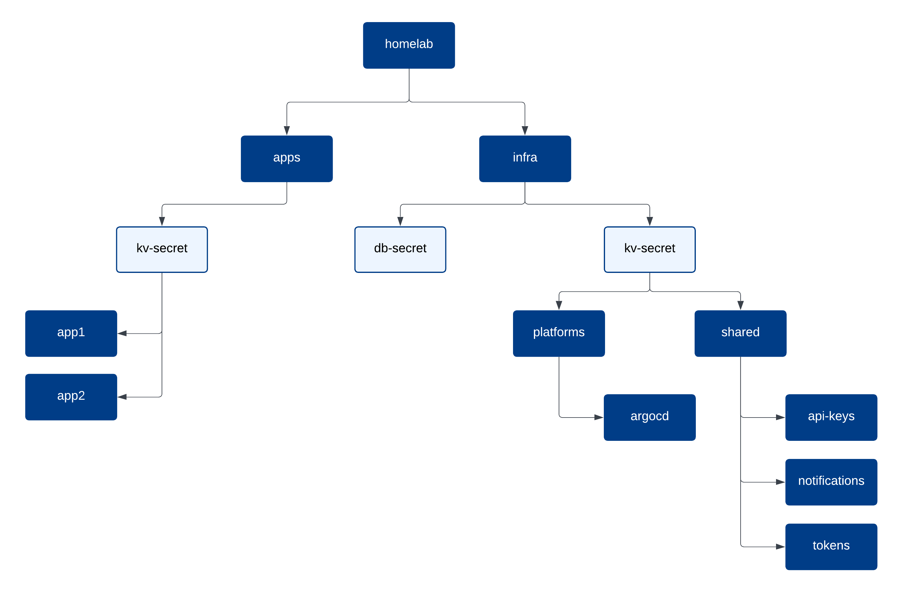

# Vault
Storing Kubernetes secrets directly in a public repository is definitely not ideal. Vault is used here as the central secrets store, with Vault Secrets Operator (VSO) responsible for making those secrets into native Kubernetes Secrets when needed. This keeps sensitive data out of source control while still allowing applications to consume secrets in a standard Kubernetes-native way.



The diagram illustrates how secrets are organized within Vault. Secrets are grouped by purpose rather than by workload type. Infrastructure-related secrets are stored separately from application-specific secrets, with an additional shared area for credentials used across multiple components, such as API keys or tokens.

For example, infrastructure services like Authentik may consume shared credentials from Vault. Vault Secrets Operator then exposes those values to Kubernetes as native Secrets using `VaultStaticSecret`, while the source of truth remains in Vault.

This layout keeps secrets scoped, reduces blast radius, and avoids coupling applications directly to Vault internals.

You may need to create additional auth methods if there are apps that directly use Vault’s API.

## Kubernetes Auth Method
The Kubernetes auth method configured via [Terraform](../terraform/phase03/README.md) is primarily intended for use by Vault Secrets Operator. When Vault is running inside the Kubernetes cluster, `token_reviewer_jwt` and `kubernetes_ca_cert` can be omitted. Vault will automatically use the service account token and CA certificate mounted at `/var/run/secrets/kubernetes.io/serviceaccount/`. In this case, the auth method can be configured as follows:
```bash
vault write auth/kubernetes/config \
    kubernetes_host=https://$KUBERNETES_SERVICE_HOST:$KUBERNETES_SERVICE_PORT
```

If Vault is running outside the cluster, both `token_reviewer_jwt` and `kubernetes_ca_cert` must be provided so Vault can validate service account JWTs and establish trust with the Kubernetes API. See the official [documentation](https://developer.hashicorp.com/vault/docs/auth/kubernetes#configuration) for more details.
```bash
vault write auth/kubernetes/config \
    token_reviewer_jwt="<your reviewer service account JWT>" \
    kubernetes_host=https://<kubernetes_api_host>:<port> \
    kubernetes_ca_cert=@ca.crt
```

This configuration tells Vault how to communicate with the Kubernetes API and verify service account tokens.

Authentication roles then define which Kubernetes service accounts are allowed to authenticate and which Vault policies they receive once authenticated.

## Secrets to Create
The Vault secrets listed here are required for platform components and applications to access the credentials they need to operate properly.

- SMTP for Authentik:
    ```bash
    vault kv put homelab/infra/kv-secret/platforms/shared/smtp \
        smtp_host='smtp.example.com' \
        smtp_port='587' \
        smtp_endpoint='smtp.example.com:587' \
        smtp_username='your_smtp_username' \
        smtp_password='your_smtp_password' \
        smtp_from_address='homelab@example.com' \
        smtp_receiver='hamada@example.com

    # To confirm
    vault kv get homelab/infra/kv-secret/platforms/shared/smtp
    ```
- Secrets for Prometheus Alertmanager config (SMTP, Slack, etc.):
    ```bash
    vault kv put homelab/infra/kv-secret/platforms/alertmanager \
        smtp_host='smtp.example.com' \
        smtp_port='587' \
        smtp_endpoint='smtp.example.com:587' \
        smtp_username='your_smtp_username' \
        smtp_password='your_smtp_password' \
        smtp_from_address='homelab@example.com' \
        smtp_receiver='hamada@example.com
    ```