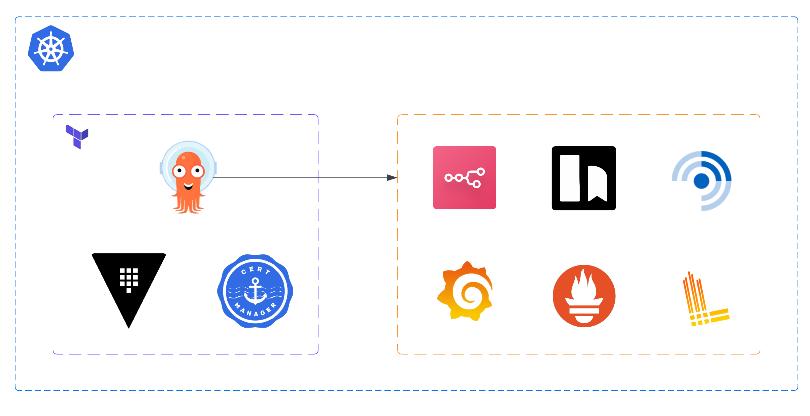

# Terraform
Terraform is used to provision and manage the cluster’s foundational platform components, such as Cilium, Vault, Cert Manager, Authentik, and Argo CD. These services form a base layer that other workloads depend on. These services are intentionally managed outside of Argo CD to avoid dependency ordering issues and manual setup steps.

Some components introduce circular dependencies when managed purely through GitOps. For example, Argo CD benefits from having SSO available immediately, which depends on Authentik. Authentik, in turn, requires secrets sourced from Vault. Managing these components through Terraform allows the entire foundation to be provisioned deterministically and with minimal manual intervention.

## Platform Provisioning


This architecture cleanly separates responsibilities between Terraform and Argo CD. Terraform provisions and maintains the core services that other workloads rely on, while Argo CD handles continuous deployment of applications.

Vault and Authentik configurations are intentionally managed through Terraform to keep their setup consistent and versioned. This approach also makes it straightforward to recreate the cluster in another environment, such as for testing or migrating to new hardware.

### Terraform Phases
Components are provisioned through five Terraform projects (phases), which must be executed in order:
- `phase01`: Deploys Cilium as the CNI with Gateway API enabled, Cert Manager, and OpenEBS to provide dynamic persistent storage (local or replicated), avoiding manual PV management.
- `phase02`: Creates a single Gateway and deploys Vault along with the Vault Secrets Operator (VSO).
- `phase03`: Manages Vault configuration as code and creates VSO connection resources for global authentication.
- `phase04`: Deploys PostgreSQL and Authentik as the central identity provider and SSO solution.
- `phase05`: Manages Authentik configuration as code, sets up applications and providers for SSO integration, and deploys Argo CD with SSO enabled.

### Prerequisites
- Terraform 1.0+.
- A valid kubeconfig for your cluster at `~/.kube/config`.
- A domain registered and managed through Cloudflare.
  - For Cert Manager's DNS challenge.

### Notes
- Internal service domains (e.g. `authentik.homelab.example.com`) are resolved locally by mapping `*.homelab.example.com` to the Gateway service IP, either via CoreDNS or a network-level DNS, avoiding public DNS and per-pod host aliases in a private home network.
  - Example below modifies CoreDNS' `ConfigMap`.
    ```
    template IN A homelab.example.com {
      match \.homelab\.example\.com
      answer "{{ .Name }} 60 IN A <GATEWAY_SVC_IP>"
      fallthrough
    }
    ```
- To enable monitoring for Cilium, Vault, VSO, and Argo CD, set `enable_monitoring = true` in each component’s `terraform.tfvars` file in `phase01`, `phase02`, and `phase05`. Do this only after kube-prometheus-stack has been deployed through Argo CD.

### Providers Used
- HashiCorp Kubernetes [provider](https://registry.terraform.io/providers/hashicorp/kubernetes/latest/docs).
- HashiCorp Helm [provider](https://registry.terraform.io/providers/hashicorp/helm/latest/docs).
- HashiCorp Vault [provider](https://registry.terraform.io/providers/hashicorp/vault/latest/docs).
- Authentik (goauthentik) [provider](https://registry.terraform.io/providers/goauthentik/authentik/latest/docs).