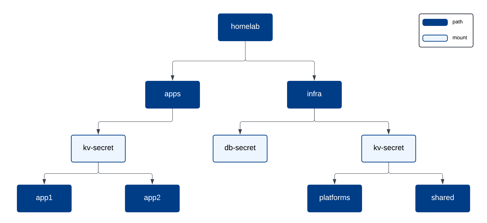

# Phase03: Vault and Vault Secrets Operator Setup
This phase sets up Vault using Terraform’s Vault provider to configure secret engines, auth methods, policies, and other core components. It also uses the Kubernetes provider to deploy the Vault Secrets Operator (VSO) `VaultConnection` and `VaultAuthGlobal`.

## Modules

### Vault
- Creates KV v2 secrets engines at the following mounts:
    - `homelab/infra/kv-secret` for storing secrets such as shared API keys and SMTP credentials.
    - `homelab/apps/kv-secret` for application secrets.
- Creates Kubernetes auth method at `kubernetes/vso` so VSO can authenticate with Vault.
- Creates Vault Policies such as the VSO read-only policy.

The diagram below shows a hierarchical organization of secrets, where infrastructure secrets are divided into shared and platform-specific items (such as API keys and tokens), and application secrets are isolated per application for development. For example, platform components like Authentik receive SMTP credentials from Vault via VSO, which exposes them as Kubernetes secrets using `VaultStaticSecret` from the `homelab/infra/kv-secret` KV v2 engine.



### VSO
- Creates a `VaultConnection` in VSO's namespace for connection definition to Vault.  
- Creates a `VaultAuthGlobal` in VSO's namespace to manage authentication across namespaces, which is referenced by the `VaultConnection` for consistent access control.
- Allows any namespace-specific `VaultAuth` to inherit configuration and authentication settings from VSO, ensuring consistent access across environments.

## Steps
1. After Vault has been successfully deployed and is running, you'll need to initialize it.
    ```bash
    vault operator init --key-shares=5 --key-threshold=3 -format=json
    ```
    - You'll probably want to store the keys somewhere secure like a password manager. I used KeePassXC and created an entry for each key to unseal easily using `unseal.sh` script.
        - If you set `key-shares` or `key-threshold` differently and use the `unseal.sh` script, you'll need to update the script accordingly.
2. After initialization, unseal Vault.
    ```bash
    vault operator unseal <key1>
    vault operator unseal <key2>
    vault operator unseal <keyn> 
    ```
    - Or you can use `unseal.sh` script if you stored the keys in KeePassXC.
3. Login by executing `vault login` then setup AppRole auth method for Terraform by executing `setup.sh` script.
    - You can use the root token for now, but it’s best to revoke it when you’re done.
    - The script will automatically generate `terraform.tfvars` for you.
4. Provision with Terraform:
    ```bash
    terraform init
    terraform plan
    terraform apply

    # Confirm
    vault secrets list
    vault auth list
    ```
5. Store required secrets in Vault, such as SMTP credentials for Authentik. 
    ```bash
    vault kv put homelab/infra/kv-secret/platforms/shared/smtp \
        smtp_host='smtp.example.com' \
        smtp_port='587' \
        smtp_username='your_smtp_username' \
        smtp_password='your_smtp_password' \
        smtp_from='your_smtp_from_email'
    
    # To confirm
    vault kv get homelab/infra/kv-secret/platforms/shared/smtp
    ```

## Notes
- Multiple KV secret mounts are implemented as a best practice to minimize the blast radius in case of a misconfiguration or compromise.
- To grant any namespace access to Vault, create `VaultAuth` and a service account (e.g., named `vso-sa`) that matches the `bound_service_account_names` in `vault_kubernetes_auth_backend_role`. This allows you to have Kubernetes secrets created using resources like `VaultStaticSecret`.
    ```yaml
    apiVersion: secrets.hashicorp.com/v1beta1
    kind: VaultAuth
    metadata:
    name: ${auth_name}
    namespace: ${namespace}
    spec:
    kubernetes:
        role: ${role}
        serviceAccount: ${service_account}
    vaultAuthGlobalRef:
        allowDefault: true
        # VSO's namespace
        namespace: ${auth_global_namespace}
    ```
- Any secrets read or written via the Vault provider in Terraform are stored in Terraform’s state and plan files. It's recommended to not include secrets in your Terraform configuration or state wherever possible ([reference](https://registry.terraform.io/providers/hashicorp/vault/latest/docs)).
- Terraform role's Secret ID lasts 4 hours, to create another one just re-execute `setup.sh`.
- Terraform Vault provider's drift detection is a best-effort feature and shouldn't be relied on, as its accuracy depends on provider design and server-managed values. For example, if you add `max_lease_ttl_seconds` and later remove it from your Terraform configuration, Vault won't detect the drift, and the value will remain as it was last set.
- It's best practice to revoke Vault's root token, you can regenerate it by following this [doc](https://developer.hashicorp.com/vault/docs/troubleshoot/generate-root-token) if needed.
- Default `VaultAuthGlobal` resources are denoted by the name `default` and are automatically referenced by all `VaultAuth` resources when `spec.vaultAuthGlobalRef.allowDefault` is set to `true` and VSO is running with the `allow-default-globals` option set in the `-global-vault-auth-options` flag (the default). This is why when creating `VaultAuth` there is no need to specify the `VaultAuthGlobal` name because it uses the `default` one ([reference](https://developer.hashicorp.com/vault/docs/deploy/kubernetes/vso/sources/vault/auth#vaultauthglobal-configuration-inheritance)).
- You may need to create additional auth methods if there are apps that directly use Vault’s API.

### Kubernetes Auth Method
For the Kubernetes auth method (which is mainly for VSO), if Vault is running inside a Kubernetes pod you may omit the `token_reviewer_jwt` and `kubernetes_ca_cert`. Vault will automatically use the service-account token and CA certificate mounted at `/var/run/secrets/kubernetes.io/serviceaccount/`. In that case you can configure it like the following:
```bash
vault write auth/kubernetes/config \
    kubernetes_host=https://$KUBERNETES_SERVICE_HOST:$KUBERNETES_SERVICE_PORT
```

If Vault is running outside the cluster, you need to provide `token_reviewer_jwt` and `kubernetes_ca_cert` in its Kubernetes auth method configuration so Vault can validate JWTs and trust the Kubernetes API (check this [doc](https://developer.hashicorp.com/vault/docs/auth/kubernetes#configuration) for more).
```bash
vault write auth/kubernetes/config \
    token_reviewer_jwt="<your reviewer service account JWT>" \
    kubernetes_host=https://192.168.99.100:<your TCP port or blank for 443> \
    kubernetes_ca_cert=@ca.crt
```

The config in the Kubernetes auth method tells Vault how to communicate with the Kubernetes API and verify service account tokens.

The role defines which Kubernetes service accounts can authenticate and what Vault policies and permissions they receive once authenticated.

### Outputs
- `vso_role_name`, `vso_namespace`, and `vso_service_account` are all used for Authentik's `VaultAuth` configs in `phase04` to authenticate with Vault's Kubernetes auth method.

### References
- Vault KV v2 secrets engines: https://developer.hashicorp.com/vault/tutorials/secrets-management/versioned-kv
- VSO authentication: https://developer.hashicorp.com/vault/docs/deploy/kubernetes/vso/sources/vault/auth
- VSO tutorial: https://developer.hashicorp.com/vault/tutorials/kubernetes-introduction/vault-secrets-operator